# Dojo Firebase

Implementación de Google Login mediante Firebase

Realizado por:
* Laura Alejandra Noreña Blandón
* Kai David Albornoz Madrigal

### Preparar proyecto base

1. Clonar el repositorio base mediante el comando:
```shell
$ git clone https://github.com/Kai-Al/dojoFirebase.git
```
2. Cargar el proyecto en Android Studio

### Configurar Firebase
Ir a la sección de **Tools** y seleccionar la opción **Firebase**

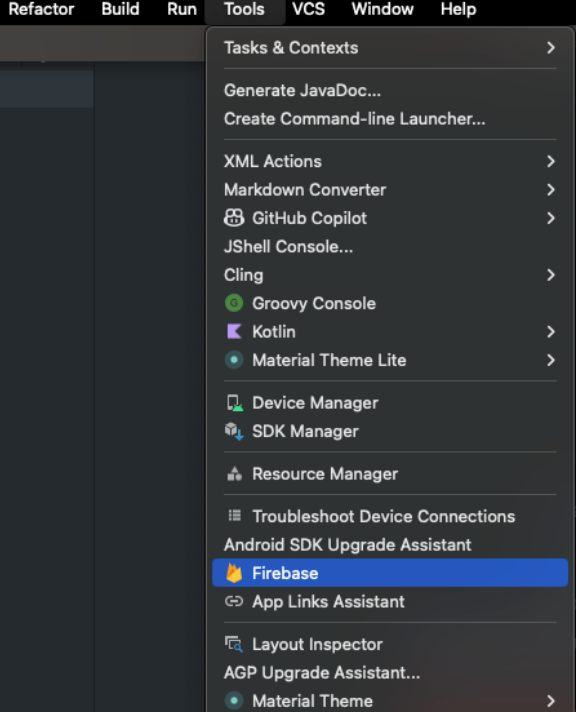

Abriendo el siguiente panel:

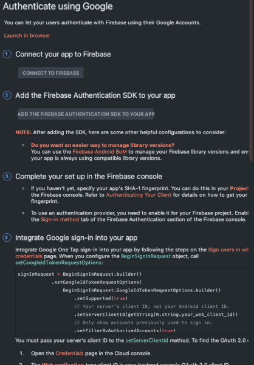

Este panel, permitirá realizar el paso a paso de la instalación de las herramientas de Google.

1. **Conectar aplicación a Firebase**

Para comenzar, se selecciona el paso número 1 del panel **Connect your app to Firebase**


Esta opción nos llevará a la página de Google en donde se iniciará sesión y se creará un proyecto nuevo.


Crear un proyecto nuevo (con el nombre que se desee) y esperar a que su creación finalice. 


Hacer click en **Conectar**, permitiendo que en Android Studio se visualice:

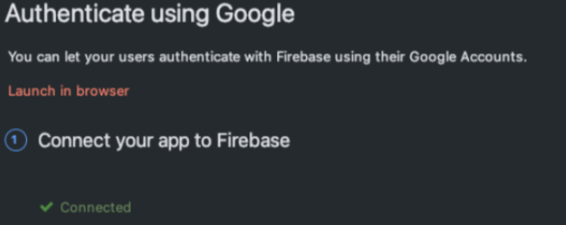

Podemos observar el proyecto creado volviendo a la consola de Firebase:

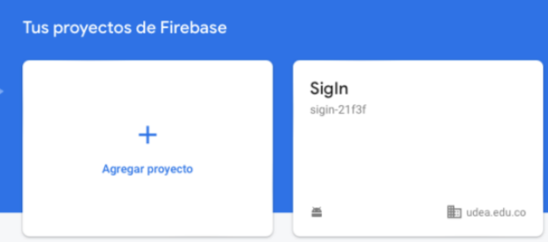

4. **Configurar proyecto (Agregar huella digital)**

Ingresar al proyecto y seleccionar **Configuración del proyecto**

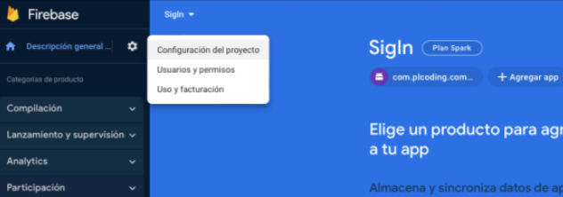

Desplazarse hasta la sección **Tus Apps** y hacer clic en **Agregar huella digital**

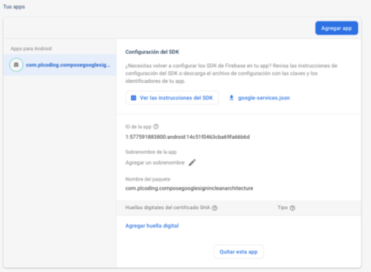

En Android Studio, ingresar a la sección **Gradle** (parte derecha del editor)
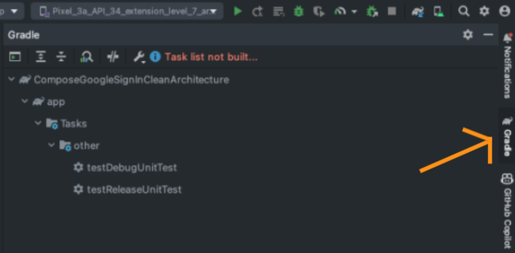

En esta imagen se observa que el listado de tareas no se encuentra activo. Para activarlo, se da click en las letras de color rojo que se pueden observar en la parte superior: **Task list not built**.
Una vez seleccionada esta opción (en la sección **Experimental**) se debe activar que se muestren todas las tareas de Gradle (**Configure all Gradle tasks during Gradle Sync...**)

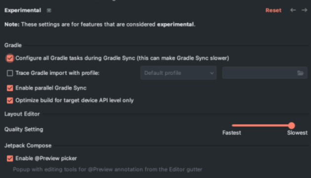

Luego, se debe sincronizar el proyecto, haciendo click en el menú **File** y en la opción **Sync Project with Gradle Files**:

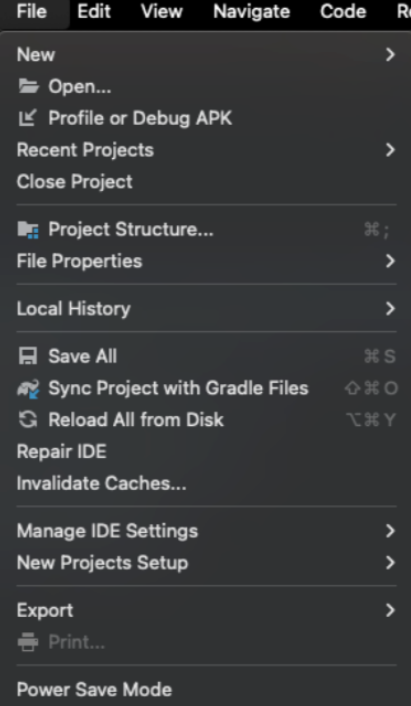

O, se puede realizar click derecho en **Gradle** y después en **Reload Gradle Project**:

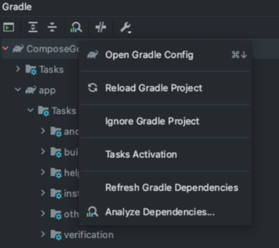

Permitiendo visualizar todas las tareas de Gradle, así:

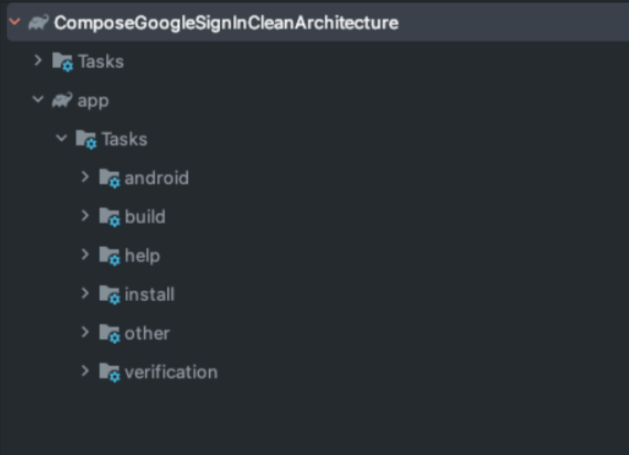

Para añadir la huella a Firebase, se necesita la tarea **signInReport** ubicada en la carpeta **android**

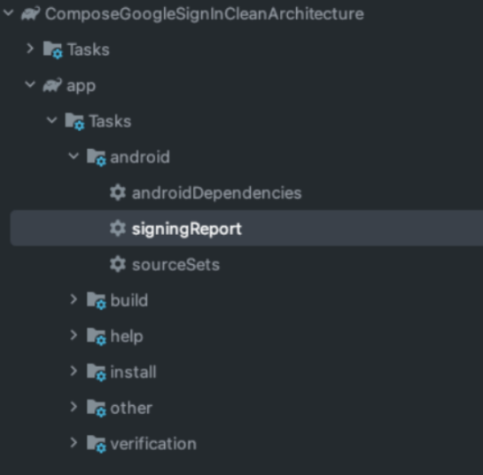

Al hacer doble click, se ejecuta la tarea brindando la siguiente información:

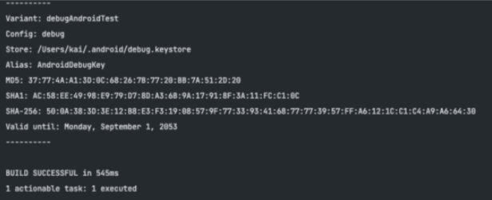

La huella que se necesita se encuentra en **SHA1**,  la cual se copia y pega en la página de Firebase:

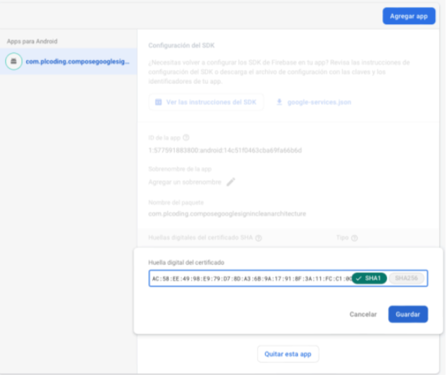

Al **Guardar** se visualiza:

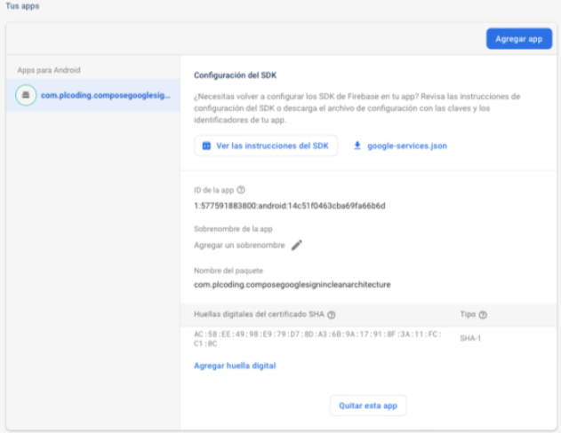

5. **Seleccionar Authentication Method**

En el panel de la izquiera, seleccionar **Authentication**

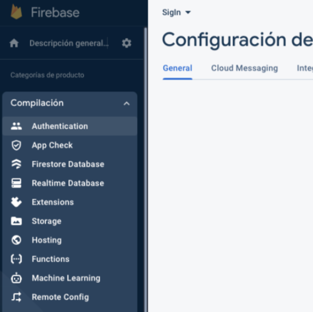

Y se selecciona **Comenzar**


De los métodos disponibles de autenticación ofrecidos por Firebase, seleccionar **Google**:

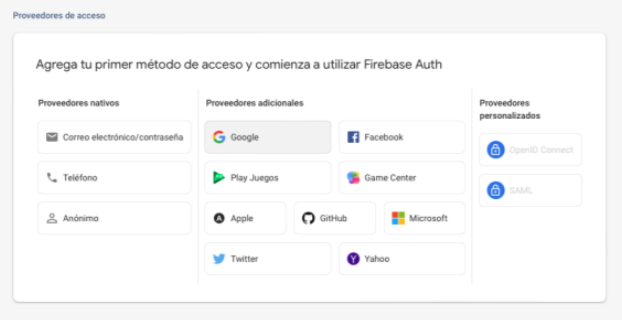

Para esta autenticación, se necesita la huella SHA1 configurada anteriormente. Ahora, se habilita la autenticación:

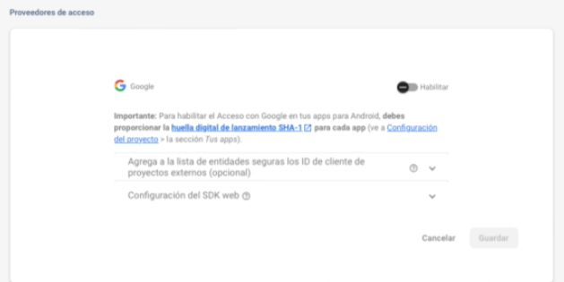

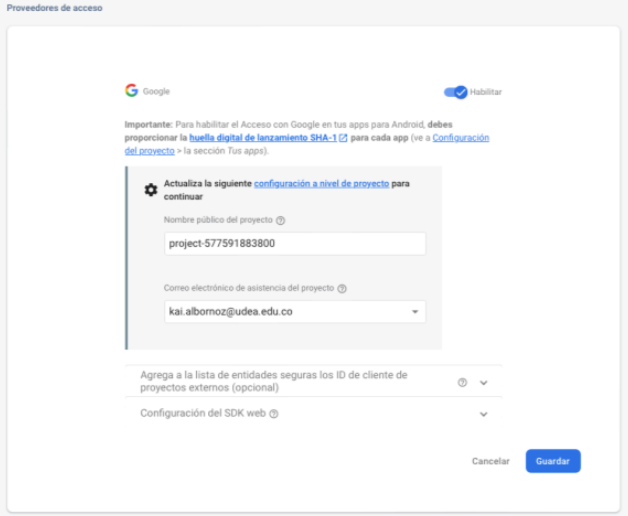

**Nombre público del proyecto**: este valor puede cambiarse para que no aparezca al momento de loguearse, pero con fines de la práctica puede quedar así.
**Correo electrónico de asistencia del proyecto**: se ingresa un correo electrónico válido.

Con estos dos valores configurados se selecciona **Guardar**, mostrando la siguiente pestaña:

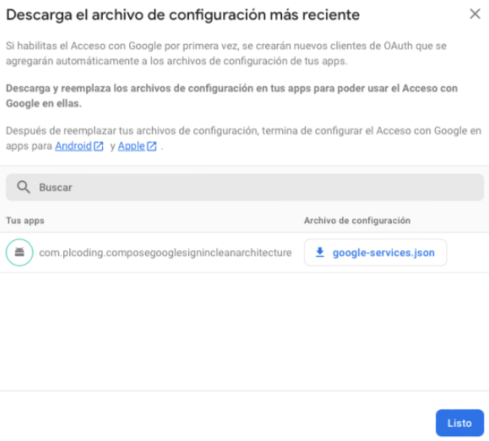

**IMPORTANTE**: el archivo llamado **google-services.json** debe ser descargado y ubicado en la carpeta **app** del proyecto.

Finalmente, se puede observar el panel de control en Firebase de la siguiente manera:

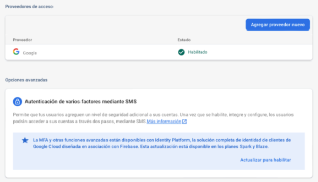

### Escribir código en Android Studio 

Una vez en Android Studio:

1. **Clase GoogleAuthUiClient**

Crear paquete dentro de la carpeta **composeGoogleSignInCleanArchitecture** llamado **presentation.sign_in**

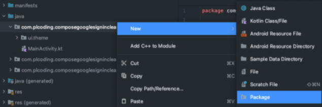

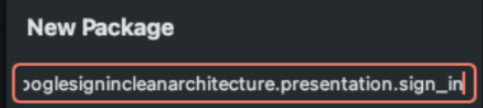

Además, se crea una clase **GoogleAuthUiClient** dentro del paquete anteriormente creado:

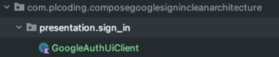

Agregar el siguiente código a la clase:

```shell
import android.content.Context
import android.content.Intent
import android.content.IntentSender
import com.google.android.gms.auth.api.identity.BeginSignInRequest
import com.google.android.gms.auth.api.identity.BeginSignInRequest.GoogleIdTokenRequestOptions
import com.google.android.gms.auth.api.identity.SignInClient
import com.google.firebase.auth.GoogleAuthProvider
import com.google.firebase.auth.ktx.auth
import com.google.firebase.ktx.Firebase
import com.plcoding.composegooglesignincleanarchitecture.R
import kotlinx.coroutines.CancellationException
import kotlinx.coroutines.tasks.await
class GoogleAuthUiClient(
    private val context: Context,
    private val oneTapClient: SignInClient
) {
    private val auth = Firebase.auth
    suspend fun signIn(): IntentSender? {
        val result = try {
            oneTapClient.beginSignIn(
                buildSignInRequest()
            ).await()
        } catch(e: Exception) {
            e.printStackTrace()
            if(e is CancellationException) throw e
            null
        }
        return result?.pendingIntent?.intentSender
    }
    suspend fun signInWithIntent(intent: Intent): SignInResult {
        val credential =
            oneTapClient.getSignInCredentialFromIntent(intent)
        val googleIdToken = credential.googleIdToken
        val googleCredentials =
            GoogleAuthProvider.getCredential(googleIdToken, null)
        return try {
            val user =
                auth.signInWithCredential(googleCredentials).await().user

            SignInResult(
                data = user?.run {
                    UserData(
                        userId = uid,

                        username = displayName,
                        profilePictureUrl = photoUrl?.toString()

                    )
                },
                errorMessage = null
            )
        } catch(e: Exception) {
            e.printStackTrace()
            if(e is CancellationException) throw e
            SignInResult(
                data = null,
                errorMessage = e.message
            )
        }
    }
    suspend fun signOut() {
        try {
            oneTapClient.signOut().await()
            auth.signOut()
        } catch(e: Exception) {
            e.printStackTrace()
            if(e is CancellationException) throw e
        }
    }
    fun getSignedInUser(): UserData? = auth.currentUser?.run {
        UserData(
            userId = uid,
            username = displayName,
            profilePictureUrl = photoUrl?.toString()
        )
    }
    private fun buildSignInRequest(): BeginSignInRequest {
        return BeginSignInRequest.Builder()
            .setGoogleIdTokenRequestOptions(
                GoogleIdTokenRequestOptions.builder()
                    .setSupported(true)
                    .setFilterByAuthorizedAccounts(false)
                    .setServerClientId(context.getString(R.string.web_client_id))
                    .build()
            )
            .setAutoSelectEnabled(true)
            .build()
    }
}
```

2. **Agregar ID de cliente web**

Regresar a la interfaz de Google y copiar el **ID de cliente web**

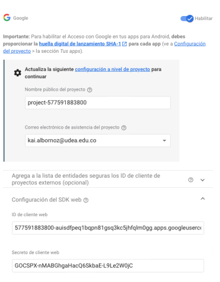

En Android Studio, abrir el archivo **strings.xml** ubicado en la carpeta de recursos

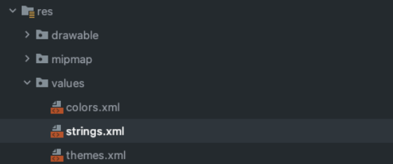

Agregar el token anteriormente copiado, en un String con el nombre **web_client_id**:

```shell
<string name="web_client_id"> copiar_token_aquí </string>
```

Así:

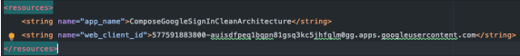

### Ejecutar aplicación

Una vez completados todos los pasos anteriormente mencionados, se ejecuta la aplicación mediante la actividad principal.

* Icono aplicación pantalla inicio:


  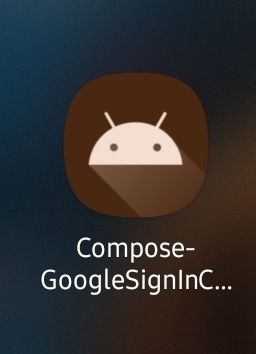

* Pantalla inicio (botón **Sign In**):


  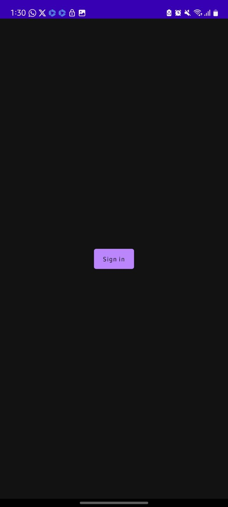

* Pantalla inicio (seleccionar cuenta de Google de las existentes en el dispositivo):


  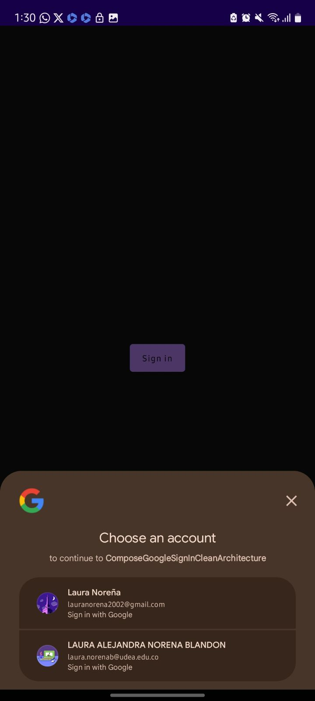

* Login exitoso (cuenta uno):


  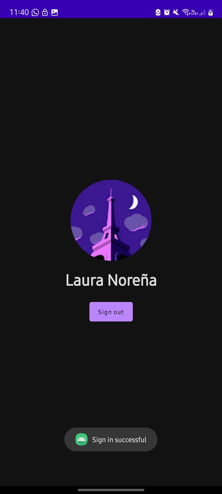

* Login exitoso (cuenta dos):


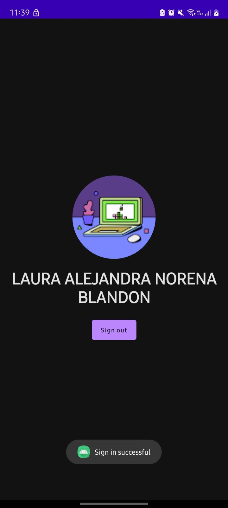

**IMPORTANTE: recuerda tener conexión a Internet para que el Login sea exitoso**

## Final Dojo Firebase

**¡FELICIDADES**, lograste completar el Dojo de Firebase existosamente!

**¡Muchas gracias por tu participación!**


